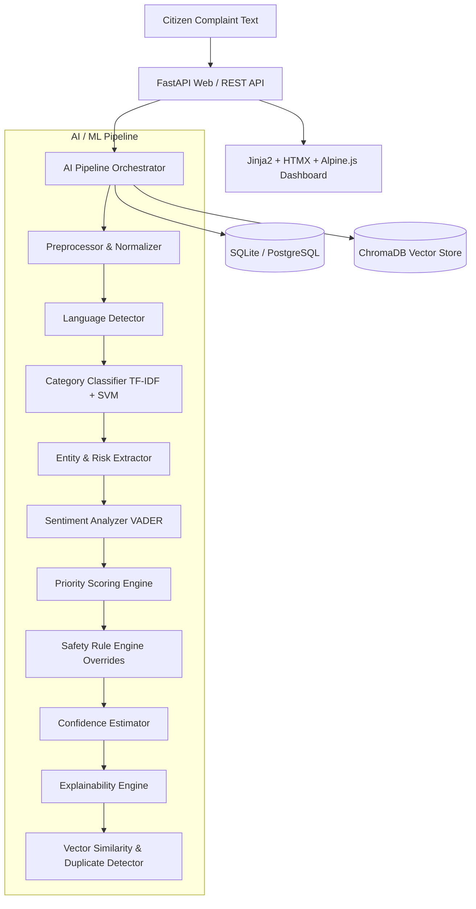

# AI-Based Complaint Priority System

A production-ready, explainable, and scalable AI-assisted citizen complaint prioritization platform built with **FastAPI**, **SQLAlchemy**, **Scikit-Learn**, **Tailwind CSS**, **HTMX**, and **Alpine.js**.

---

## 🎯 Core Objectives & Capabilities

Traditional ticketing systems prioritize complaints purely based on arbitrary manual flags or raw emotional sentiment ("URGENT!!!"). This platform solves that problem through a **multi-dimensional, explainable AI pipeline**:

1. **Semantic Category Classification**: Uses TF-IDF + Linear Support Vector Classification (LinearSVC) achieving **99% accuracy**, with robust keyword fallback.
2. **Entity & Risk Extraction**: Parses locations, affected population estimates, ongoing durations, safety hazards, vulnerable populations (children, elderly, schools, hospitals), and essential service disruptions.
3. **Deterministic Multi-Factor Scoring (0–100)**:
   - **Urgency** (25% weight)
   - **Severity** (25% weight)
   - **Impact** (20% weight)
   - **Safety Risk** (20% weight)
   - **Duration** (10% weight)
4. **Non-Downgrade Safety Rules Engine**: Hard business rules that can **only escalate** priority (never downgrade). Life-safety hazards (exposed wires, gas leaks, collapse, fire) and extended essential service disruptions automatically escalate to **CRITICAL**.
5. **Real-World Impact Over Sentiment**: Rants without actionable danger remain `LOW` priority, while calm reports of live wires or no drinking water for infants/elderly immediately escalate to `CRITICAL`.
6. **Transparent Explainability**: Explains the exact reasoning and recommended operational response for every complaint without hallucination.
7. **Semantic Duplicate Detection**: Embedded vector similarity (ChromaDB / TF-IDF) identifies near-duplicates and recurring incidents.
8. **Human-in-the-Loop Override & Auditability**: Operators can override AI decisions with mandatory rationale, automatically updating SLAs and maintaining a complete tamper-proof audit trail.

---

## 🏗️ Architecture



---

## 🚀 Quickstart

### Prerequisites
- Python 3.10+ (Tested on Python 3.14 on Windows)
- pip

### 1. Installation
Clone or navigate to the project directory:
```bash
cd complaint-priority-system
pip install -r requirements.txt
```

### 2. Environment Configuration
Copy the example environment file:
```bash
cp .env.example .env
```
Default credentials:
- **Admin Username**: `admin`
- **Admin Password**: `admin123`

### 3. Generate Synthetic Data & Train Classifier
```bash
# Generate 500 realistic complaints with edge cases
python -m ai.training.generate_synthetic

# Train the category classifier
python -m ai.training.train_classifier

# Evaluate model and priority engine
python -m ai.training.evaluate
```

### 4. Run Development Server
```bash
python -m uvicorn app.main:app --host 127.0.0.1 --port 8000 --reload
```
Open your browser at **[http://127.0.0.1:8000](http://127.0.0.1:8000)**.

---

## 🐳 Docker Deployment

Run the complete application in an isolated Docker container with zero setup:

```bash
docker-compose up --build
```
Access the dashboard at **[http://localhost:8000](http://localhost:8000)**.

---

## 📊 Priority Scoring & SLA Policies

### Score Thresholds
| Priority | Score Range | SLA Response | SLA Resolution |
|:---|:---:|:---:|:---:|
| **CRITICAL** | 80 – 100 | 1 Hour | 4 Hours |
| **HIGH** | 60 – 79 | 4 Hours | 24 Hours |
| **MEDIUM** | 35 – 59 | 24 Hours | 72 Hours |
| **LOW** | 0 – 34 | 72 Hours | 168 Hours (7 Days) |

---

## 🧪 Running Tests

The test suite includes 15 comprehensive unit and integration tests covering API endpoints, edge cases, scoring bounds, and safety rule overrides:

```bash
python -m pytest tests -v
```

---

## 📖 API Endpoints

| Method | Endpoint | Description |
|:---|:---|:---|
| `GET` | `/api/health` | Healthcheck endpoint |
| `POST` | `/api/auth/login` | Session and Bearer token login |
| `GET` | `/api/categories` | List active service categories |
| `POST` | `/api/complaints` | Submit a new complaint |
| `GET` | `/api/complaints` | Paginated complaint search & filter |
| `GET` | `/api/complaints/{id}` | Full complaint details with AI analysis |
| `POST` | `/api/complaints/{id}/analyze` | Trigger AI pipeline analysis |
| `POST` | `/api/complaints/{id}/override` | Human operator priority override |
| `GET` | `/api/complaints/{id}/similar` | Find semantic duplicates |
| `GET` | `/api/dashboard/summary` | Real-time KPI statistics |
| `GET` | `/api/dashboard/analytics` | 30-day volume trends and distribution |

---

## 🔒 Security & RBAC

- **Authentication**: Signed session cookies (`itsdangerous`) + HTTP Bearer tokens.
- **Authorization**: Role-Based Access Control (`admin`, `operator`, `viewer`).
- **Rate Limiting**: Configurable IP rate-limiting (`slowapi`).
- **Audit Logging**: All priority overrides and status transitions recorded in the database with timestamps and operator identity.
